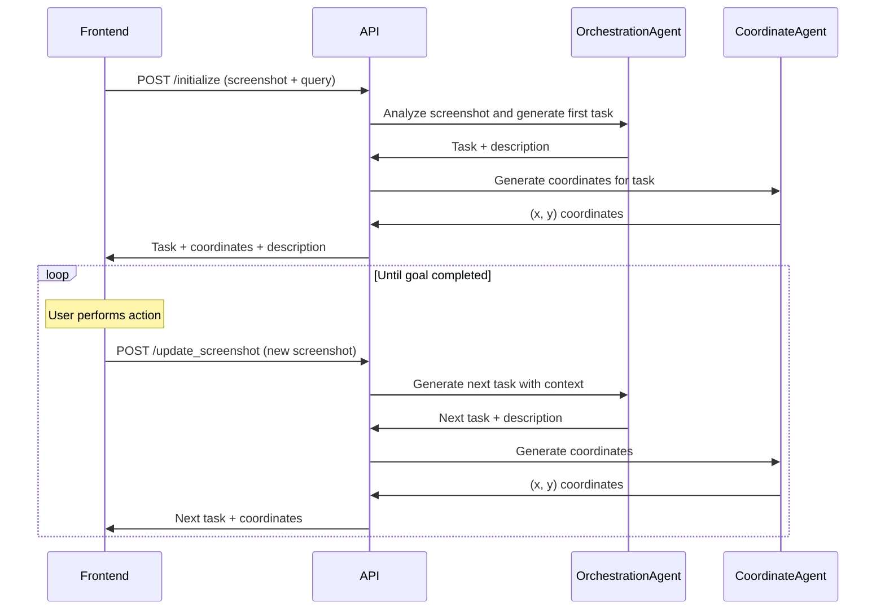

# AI Agent Backend

A FastAPI-based backend service that provides multimodal AI agents for UI automation. The system uses LangChain and LangGraph to orchestrate agents that can analyze screenshots, generate tasks, and provide precise coordinates for UI interactions.

## Features

- **Multimodal AI Agents**: Uses Claude (Anthropic) for vision and reasoning capabilities
- **Task Orchestration**: Breaks down user requests into actionable tasks
- **Coordinate Generation**: Provides precise (x,y) coordinates for UI interactions
- **RESTful API**: FastAPI endpoints for frontend integration
- **State Management**: Maintains conversation and task history throughout sessions

## Quick Start

1. **Install Dependencies**
   ```bash
   pip install -r requirements.txt
   ```

2. **Set up Environment Variables**
   ```bash
   cp .env.example .env
   # Add your ANTHROPIC_API_KEY to .env
   ```

3. **Run the Server**
   ```bash
   python main.py
   # Server will start on http://localhost:8000
   ```

4. **Test the API**
   ```bash
   python test_api_endpoints.py screenshot.png "Send an email to someone"
   ```

## API Endpoints

### 🚀 **POST** `/initialize`

Initialize a new session with a screenshot and user query. Returns the first task and coordinates.

**Request Body:**
```json
{
  "user_query": "Send an email to john@example.com",
  "screenshot_base64": "iVBORw0KGgoAAAANSUhEUgAA..."
}
```

**Response:**
```json
{
  "x": 1198,
  "y": 252,
  "task": "Click on the search bar",
  "task_description": "User wants to email someone on gmail, currently on Firefox home page, first task is to click on the search bar",
  "is_completed": false
}
```

**Use Case:** Start a new automation session when the user provides their goal and initial screenshot.

---

### 🔄 **POST** `/update_screenshot`

Update the screenshot after completing a task and get the next task with coordinates.

**Request Body:**
```json
{
  "screenshot_base64": "iVBORw0KGgoAAAANSUhEUgAA..."
}
```

**Response:**
```json
{
  "x": 640,
  "y": 180,
  "task": "Type 'gmail.com' in the search bar",
  "task_description": "User clicked on search bar successfully, now need to type 'gmail.com' to navigate",
  "is_completed": false
}
```

**Use Case:** Continue the workflow after the user has completed the previous task.

---

### 📊 **GET** `/status`

Get the current status of the active session.

**Response (No Active Session):**
```json
{
  "status": "No active session"
}
```

**Response (Active Session):**
```json
{
  "status": "Active session",
  "current_task": "Click on the search bar",
  "task_description": "User wants to email someone...",
  "coordinates": [1198, 252],
  "is_completed": false,
  "task_history_count": 3
}
```

**Use Case:** Check session state, useful for debugging or frontend state synchronization.

---

### 🔄 **POST** `/reset`

Reset the current session and clear all state.

**Response:**
```json
{
  "message": "Session reset successfully"
}
```

**Use Case:** Start fresh or clear a stuck session.

---

### ❤️ **GET** `/health`

Health check endpoint to verify the service is running.

**Response:**
```json
{
  "status": "healthy"
}
```

**Use Case:** Load balancer health checks, monitoring, service verification.

## Workflow



## Error Handling

All endpoints return appropriate HTTP status codes:

- **200**: Success
- **400**: Bad Request (e.g., no active session for update_screenshot)
- **500**: Internal Server Error (e.g., invalid base64, agent errors)

**Error Response Format:**
```json
{
  "detail": "Error message describing what went wrong"
}
```

## State Management

The backend maintains state throughout a session:

- **screenshot_image**: Current screenshot data
- **user_query**: Original user request
- **current_task**: Current task to execute
- **task_description**: Contextual description
- **task_history**: List of completed tasks
- **chat_history**: Log of all agent interactions
- **coordinates**: Current (x, y) coordinates
- **is_task_completed**: Whether the goal is accomplished

## Testing

Run the comprehensive test suite:

```bash
python test_api_endpoints.py screenshot.png "Your test query"
```

The test covers:
- All API endpoints
- Error handling scenarios
- Complete workflow simulation
- Response validation

## CORS Configuration

The API is configured with permissive CORS for development:

```python
allow_origins=["*"]  # Configure for production
allow_methods=["*"]
allow_headers=["*"]
```

**⚠️ For production**: Update CORS settings to specify actual frontend URLs.

## Dependencies

- **FastAPI**: Web framework
- **LangChain**: Agent framework
- **LangGraph**: Workflow orchestration
- **Claude (Anthropic)**: Multimodal LLM
- **Pydantic**: Data validation
- **Uvicorn**: ASGI server

## Architecture

```
┌─────────────────┐    ┌──────────────────┐    ┌─────────────────┐
│    Frontend     │───▶│   FastAPI API    │───▶│  Agent System   │
│                 │    │                  │    │                 │
│ • Screenshots   │    │ • /initialize    │    │ • Orchestration │
│ • User Actions  │    │ • /update_screenshot│ │ • Coordinates   │
│ • Coordinates   │    │ • /status        │    │ • State Mgmt    │
└─────────────────┘    └──────────────────┘    └─────────────────┘
```

The system follows a single-task workflow where one task is generated at a time, executed by the user, then the next task is generated based on the new screenshot.